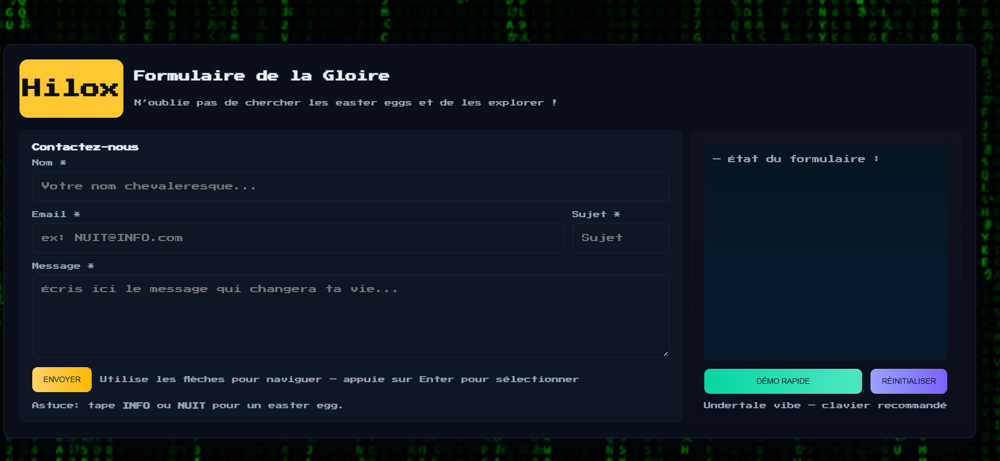

# Formulaire de la Gloire — Formulaire de Contact Ultime



Un formulaire de contact rétro et interactif, inspiré d’Undertale, rempli de fun easter eggs, de visuels pixelisés, et d’un fond interactif style Matrix. Conçu pour allier plaisir et fonctionnalité, il démontre des techniques avancées de frontend, incluant la navigation au clavier, les effets sonores, les effets visuels et la validation client-side du formulaire.

---

## Table des matières

1. [Technologies](#technologies)
2. [Présentation du projet](#présentation-du-projet)
3. [Fonctionnalités](#fonctionnalités)
4. [Comment utiliser le formulaire](#comment-utiliser-le-formulaire)
5. [Navigation au clavier](#navigation-au-clavier)
6. [Easter Eggs](#easter-eggs)
7. [Installation & Exécution](#installation--exécution)
8. [Contributions](#contributions)
9. [Auteur](#auteur)

---

## Technologies

- **HTML5** — structure sémantique pour le formulaire et les dialogues
- **CSS3 / Variables personnalisées** — UI pixel rétro, fond interactif Matrix, animations, confettis
- **JavaScript (ES6)** — validation du formulaire, easter eggs, animation dactylographique, retour audio, manipulation du DOM
- **Web Audio API** — effets sonores (bips, notes musicales)
- **Canvas API** — fond interactif pixel/Matrix et effets de confettis
- **Backend optionnel** — soumission simulée du formulaire avec téléchargement JSON de secours

---

## Présentation du projet

Ce projet est un formulaire de contact avec une **ambiance rétro gaming** inspirée d’Undertale. Il est enrichi de :

- Retour audio lors de la saisie ou de l’interaction avec l’interface
- Feedback visuel avec confettis, alertes dorées et fond Matrix interactif
- Plusieurs easter eggs cachés activés en tapant des mots-clés, le code Konami, ou en interagissant avec certains éléments
- Navigation clavier pratique pour accessibilité et ambiance rétro

Le projet fonctionne **entièrement côté client**, avec un téléchargement JSON de secours si aucun backend n’existe.

---

## Fonctionnalités

### Formulaire

- Champs obligatoires : `Nom`, `Email`, `Sujet`, `Message`
- Validation client-side en temps réel
- Feedback visuel pour les champs invalides (bordure rouge)
- Le bouton d’envoi déclenche animation dactylographique, effets sonores et confettis en cas de succès
- Bouton de démonstration pour tester instantanément

### Dialogues / Alertes

- Pop-ups avec animation typewriter
- Mode “Golden Glory” pour messages spéciaux
- Alertes avec bouton “OK” mobile pour interactivité
- Fermeture des alertes via la touche ESC

### Retour audio

- Bips lors de la saisie ou des nouvelles lignes
- Courtes séquences musicales lors de l’envoi du formulaire ou activation des easter eggs

### Fond style Matrix

- Effet pluie pixel/matrix interactif sur le canvas
- Fond réactif aux easter eggs ou déclencheurs spéciaux

---

## Comment utiliser le formulaire

1. Remplir les champs obligatoires : `Nom`, `Email`, `Sujet`, `Message`
2. Utiliser les **flèches du clavier** pour naviguer entre les champs (Haut/Bas ou Tab)
3. Appuyer sur **Enter** sur le bouton d’envoi pour soumettre le formulaire
4. Lors de l’envoi :
   - Le formulaire est validé
   - L’animation typewriter affiche la confirmation
   - Les notes musicales jouent
   - Les confettis explosent si des mots-clés spéciaux sont détectés

---

## Navigation au clavier

- **Flèche Bas / Tab** → passer au champ suivant
- **Flèche Haut** → revenir au champ précédent
- **Enter** → active le bouton focalisé (envoyer, démo, ou réinitialiser)

Cette navigation imite **l’interface rétro style Undertale**.

---

## Easter Eggs

De multiples interactions cachées enrichissent l’expérience rétro :

### Easter Eggs textuels

- Taper **INFO**, **NUIT**, ou **GLORY** déclenche des effets spéciaux :
  - Alerte pop-up dorée (`GLORY`)
  - Effets Matrix / confettis (`INFO` / `NUIT`)
- Mots-clés dans `Sujet` ou `Message` comme `gagner` déclenchent des messages “Félicitations, vous avez gagné !”

### Interactions avec les champs

- Bips ou notes musicales
- Étincelles pixelisées visuelles

### Easter Egg du logo draggable

- Déplacer le logo révèle un message caché
- Le logo réagit au mouvement avec feedback visuel

---

## Installation & Exécution

1. Cloner le dépôt :

```bash
https://github.com/HiloxTeamNuitDeInfo2025/Formulaire-de-la-Gloire.git
cd Formulaire-de-la-Gloire
```
